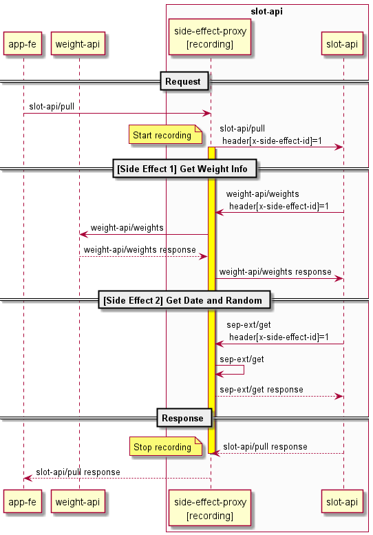
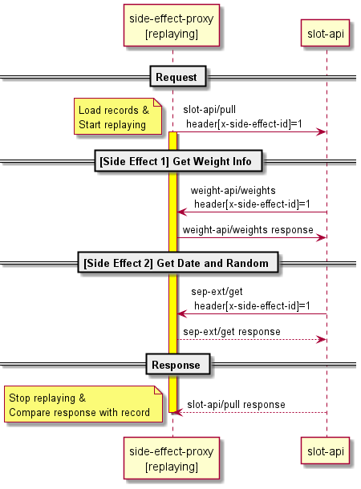

# replayable-slot-machine
A demo of Side Effect Recorder. Entry in the yyt #22.

## Sequence Diagrams

### Recording

### Replaying

## Running

### Prerequisite
* `npm install` for `app-fe`, `wiehgt-api`, `side-effect-proxy` and `slot-api` 

### Recording

1. Start app-fe
    * `cd app-fe && npm start`
1. Start weight-api
    * `cd weight-api && npm start`
1. Start side-effect-proxy
    * `cd side-effect-proxy && npm start`
1. Start slot-api
    * `cd slot-api && npm start`
1. Change weights
    * http://localhost:10004/weights/edit
1. Pull slot machine
    * http://localhost:10000
1. Check records
    * repository/records/records.jsonl

### Replaying

1. Desired status of servers
    * app-fe: may be stopped
    * weight-fe: may be stopped
    * side-effect-proxy: must be stopped
    * slot-api: must be running
1. Start side-effect-proxy replaying mode
    * `cd side-effect-proxy && npm run replay`
1. Check console results
